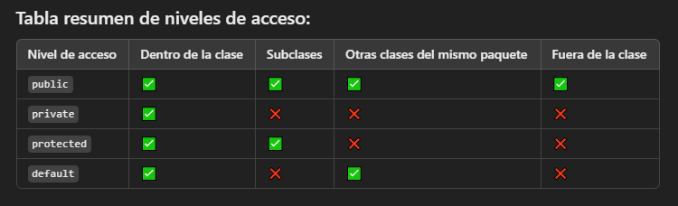

# POO_SOLID

## Pilares de POO

1. Encapsulamiento

principio que consiste en restringir el acceso directo a los atributos y métodos de un objeto, permitiendo que estos solo sean manipulados a través de métodos definidos en la clase. Esto protege el estado interno del objeto y asegura que solo se pueda modificar de forma controlada

2. Abstraccion

Principio fundamental que consiste en ocultar los detalles internos de implementación de una clase y exponer solo las funcionalidades relevantes o esenciales para el usuario. El objetivo principal es simplificar la complejidad y centrar la atención en lo que un objeto puede hacer, en lugar de cómo lo hace

3. Herencia
   Permite que las subclases hereden comportamientos y propiedades de las superclases, ofreciendo flexibilidad y modularidad.

- Herencia Multiple: cuando se hereda de dos clases

4. Polimorfismo
   capacidad de un objeto para adoptar diferentes formas. Más específicamente, permite que una misma acción se comporte de manera distinta según el contexto. Esto se logra a través de métodos que comparten el mismo nombre, pero que tienen implementaciones diferentes en clases relacionadas.

- Tipos de Polimorfismo
  4.1 El polimorfismo en Programación Orientada a Objetos (POO) es la capacidad de un objeto para adoptar diferentes formas. Más específicamente, permite que una misma acción se comporte de manera distinta según el contexto. Esto se logra a través de métodos que comparten el mismo nombre, pero que tienen implementaciones diferentes en clases relacionadas.
  4.2 Polimorfismo de Sobrescritura (Overriding): Consiste en redefinir un método de la clase base en una subclase.
  4.3 Polimorfismo de Inclusión (Herencia):
- Clases abstractas e Interfaces
  4.4 Clases asbstractas:
  - No pueden ser instanciadas.
  - No pueden crear un objecto.
  - Estas solo sirven para heredar sus funcionalidades.
  - Deben de tener un atributo y un metodo abstracto para ser consideradas clases abstractas al 100%
    4.5 Interfaces:
  - Es un contrato que contiene metodos abstractos que son obligatorios
  - La interfaz no es una clase (no pueden tener atributos, o constructor)
  -

Glosario:

- Atributos y Metodos estaticos: son los que no necesitan una instancia para ser ejecutados

- Clases
  propiedades: - Atributos - Metodos - un Constructor
  Objetos: son creados a partir de las clases por medio de una instancia (instanciar la clase)

- Constructor:
  Es un metodo especial que se ejecuta de manera automatica cuando creamos una instancia de clase y permite inicializar un objeto
- Constructor por defecto (vacio):
  se inicializa vacio por defecto
- Constructor por defecto (estatico):
  crea un objeto a partir de la informacion brindada en la clase, la cual es estatica y ejecuta un nuevo objeto con dicha informacion por defecto
- Constructor parametrizado:
  Es el consgtructor que se declara en la clase, y requiere parametros asignados a los atributos de la clase, para que cuando sea instanciada la clase, los valores del nuevo objeto sean pasados atravez de esta.

- Diferencia entre Parametro vs Atributo
  los parametros son valores que alimentan al constructor o metodo
  los atributos son propiedades que almacenan informacfion del objeto

## Principios SOLID y patrones de diseño

S - Single Responsability principle: designar una sola finalidad a cada clase.
O - Open / Closed principle: No toques el codigo que funciona; mejor extiendelo. (cerrados a modificacion, abiertos a extension)
L - Liskov Substitution principle:
I - Interface Segregation principle:
D -

Acoplacion: Es cómo de dependientes están los módulos entre sí.

- Acoplamiento fuerte: Los módulos están muy conectados. Cambiar uno afecta al otro (¡malo!).
- Acoplamiento débil: Los módulos casi no dependen entre sí. Puedes cambiar uno sin romper los demás (¡bueno!).

Cohesion: Es cómo de relacionadas están las tareas dentro de un mismo módulo.

- Cohesión alta: El módulo hace solo una cosa y lo hace bien (¡bueno!).
- Cohesión baja: El módulo hace muchas cosas diferentes y sin relación (¡malo!)
